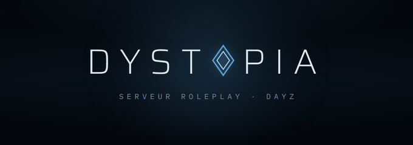
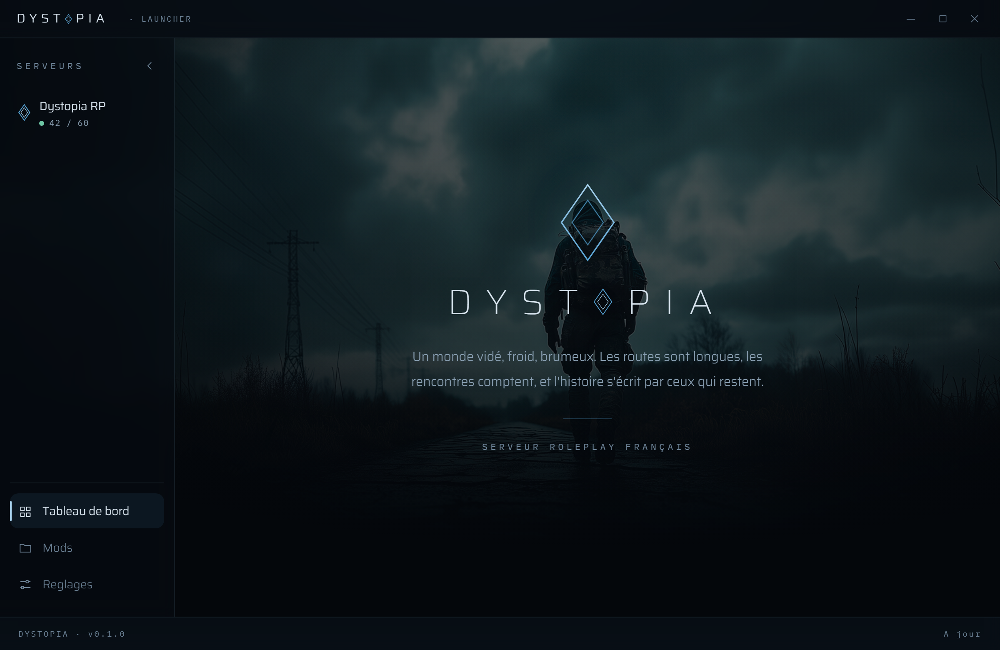
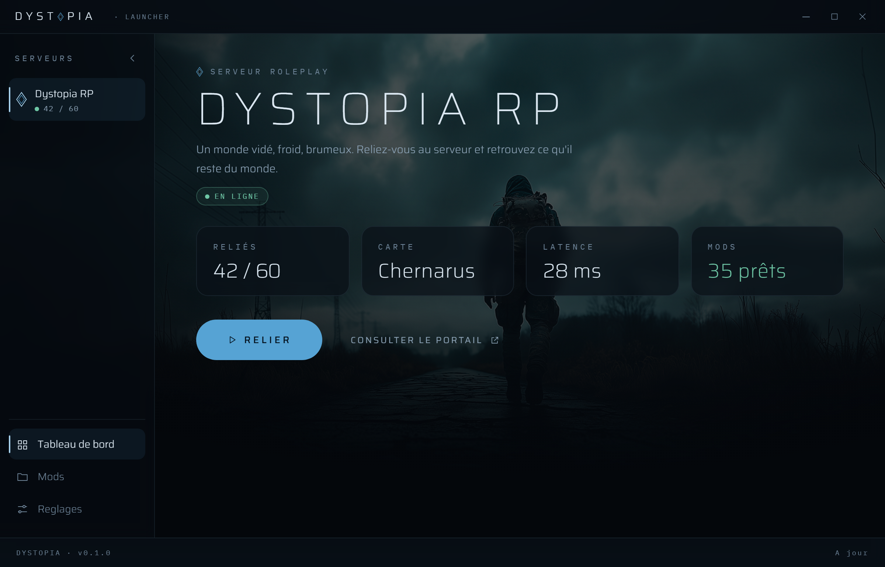

  

<h1 align="center">Dystopia Launcher</h1>

  Le launcher officiel du serveur DayZ roleplay français <strong>Dystopia</strong>. 
  Un monde vidé, froid, brumeux. Reliez-vous, et retrouvez ce qu'il reste du monde.

  <a href="https://github.com/Dystopia-Roleplay-Launcher/launcher/releases/latest"><strong>Télécharger la dernière version</strong></a>
  &nbsp;·&nbsp;
  <a href="https://dystopia-rp.com">Site</a>
  &nbsp;·&nbsp;
  <a href="https://portail.dystopia-rp.com">Portail</a>

---

## Installation

1. Ouvrir la page **[Releases](https://github.com/Dystopia-Roleplay-Launcher/launcher/releases/latest)** et télécharger le fichier **`Dystopia.Launcher_x.y.z_x64-setup.exe`**.
2. Lancer l'installeur. Windows affichera « Windows a protégé votre ordinateur » (éditeur inconnu, le launcher n'est pas encore signé) : cliquer sur **Informations complémentaires**, puis **Exécuter quand même**.
3. C'est tout. Le launcher s'ouvre, détecte Steam et DayZ, et se met à jour tout seul à chaque nouvelle version.

> Le fichier `.msi` présent dans les Releases est un format secondaire : préférer le `-setup.exe`, c'est lui que les mises à jour automatiques utilisent.

## Ce que fait le launcher

- **Se relier en un clic** : le launcher lance DayZ directement connecté au serveur Dystopia, avec les bons mods dans le bon ordre.
- **Mods automatiques** : la liste des mods est lue en direct depuis le serveur. Les mods manquants se téléchargent via Steam d'un clic, avec barre de progression. Un mod abîmé se répare d'un clic.
- **État du serveur en direct** : joueurs connectés, carte, latence.
- **Présence Discord** : vos amis voient que vous êtes sur Dystopia.
- **Mises à jour automatiques** : le launcher se tient à jour tout seul, signé et vérifié.

## Nouveautés (v0.1.2)

- Vérification renforcée des mods : un mod au contenu invalide est signalé « à réparer » avant la connexion, plus de mauvaise surprise en jeu.
- État d'abonnement Workshop : les mods présents sur le disque mais non abonnés sont marqués, abonnement en un clic.
- Lancement plus clair : le launcher reste visible pendant le démarrage du jeu, puis affiche « Jeu lancé » avec un bouton pour fermer le jeu.
- Présence Discord plus juste : les joueurs connectés ne s'affichent que quand vous êtes en jeu.
- Bouton d'actualisation de l'état du serveur, installeur en français.

## Prérequis

| | |
|---|---|
| Système | Windows 10 ou 11 (64 bits) |
| Jeu | DayZ possédé sur Steam, Steam installé |
| Espace | Les mods du serveur (comptez plusieurs Go, téléchargés par Steam) |

## Questions fréquentes

**Windows bloque l'installation.**
Normal pour l'instant : le launcher n'a pas encore de signature d'éditeur payante. « Informations complémentaires » puis « Exécuter quand même ». Chaque version est construite et publiée automatiquement depuis le code source, et les mises à jour sont vérifiées par signature cryptographique avant installation.

**Steam affiche « joue à DayZ » quand le launcher est ouvert.**
Normal : le launcher dialogue avec Steam comme le launcher DayZ officiel pour gérer les mods du Workshop. C'est le fonctionnement de tous les launchers DayZ (DZSA compris).

**Un pseudo m'est demandé avant de me relier.**
C'est votre nom de survivant en jeu. Sur un serveur roleplay, il compte. Il est conservé pour les prochains lancements et modifiable dans les Réglages.

**Où est installé le launcher, comment le désinstaller.**
Dans votre profil utilisateur (aucun droit administrateur requis). Désinstallation classique par Paramètres Windows, Applications.

## Aperçu

  

  

---

  Le code source du launcher est privé. Ce dépôt porte les versions publiées et le manifeste de mise à jour <code>latest.json</code> que le launcher consulte au démarrage.

